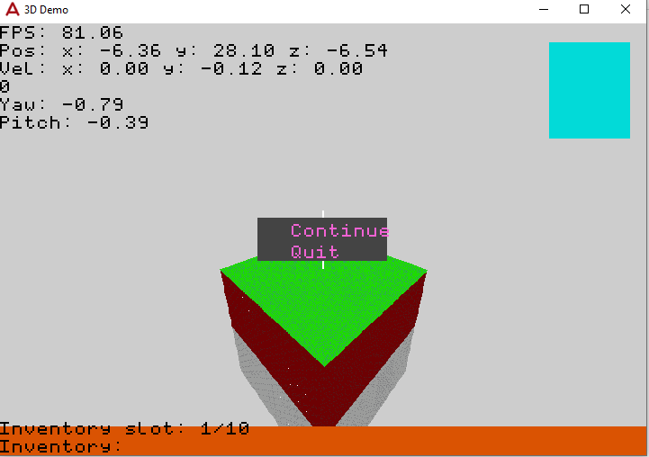

# 3D-Engine

The goal of this project is to learn basics behind building window applications and 2D/3D games.

=============

Work ended on this project in December 2020. Here are some screenshots to show what was finished:

Main menu of the game with three clickable buttons.

In-game image showcasing the 3D Minecraft-like block world, where blocks are textured.

Showcase of generated cube world where the surface is covered in grass, with dirt and stone neneath.

Close-up image showing the verticies used to render 3D textured cubes within the world.

Cubem map used for textured grass blocks.

Map for main menu buttons with three states: standard, hover, and active.

Map for text font used for rendering text on screen.

Left off trying to optismise performance and by loading the world in by "chunks" like minecraft.
